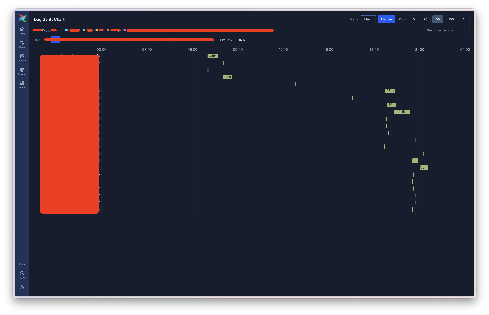
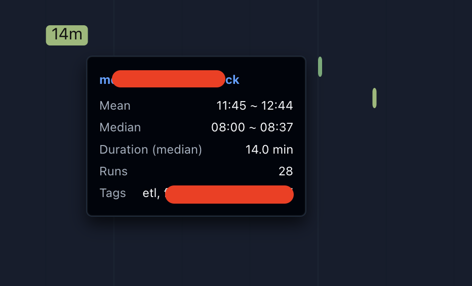

# airflow-dag-gantt

Airflow 3.x plugin that visualizes Dag execution times as a 24-hour Gantt chart.

Shows average/median start and end times for each Dag based on recent successful runs. Uses `react_apps` to render natively within the Airflow UI.





## Requirements

- Python >= 3.10
- Apache Airflow >= 3.0.0

## Installation

```bash
pip install airflow-dag-gantt
```

Or install from source:

```bash
pip install git+https://github.com/choo121600/airflow-dag-gantt.git
```

## Configuration

No additional configuration required. The plugin uses the logged-in user's session to call Airflow's REST API (`/api/v2/`) directly from the browser.

After installation, restart the webserver:

```bash
sudo systemctl restart airflow-webserver
```

## Features

- **24h timeline Gantt chart** with responsive width (ResizeObserver)
- **Mean/Median toggle** for execution time statistics
- **Run count selector**: 10, 25, 50, 100, or All
- **Prefix-based color grouping**: Dag ID prefix별 자동 색상 구분
- **Tag-based filtering**: tag 버튼 토글로 Dag 필터링 (12개 미리보기 + 확장)
- **Text search**: Dag name 및 tag 통합 검색
- **Filter reset**: 모든 필터 초기화 버튼
- **Hover tooltips**: mean/median start/end, duration, run count, tags
- **Browser timezone**: 시간축이 브라우저 로컬 시간대 기준으로 표시

## UI Development

```bash
cd ui
pnpm install
pnpm dev          # Dev server at localhost:5173
pnpm build        # Build UMD bundle to dist/main.umd.cjs
```

After building, copy the bundle:

```bash
cp ui/dist/main.umd.cjs src/airflow_dag_gantt/dist/
```

## Tech Stack

- **Frontend**: React 19, TypeScript, ChakraUI v3, Vite (UMD build)
- **Backend**: FastAPI (Airflow plugin, static file serving only)
- **Integration**: Airflow 3.x `react_apps` plugin API

## License

Apache License 2.0
